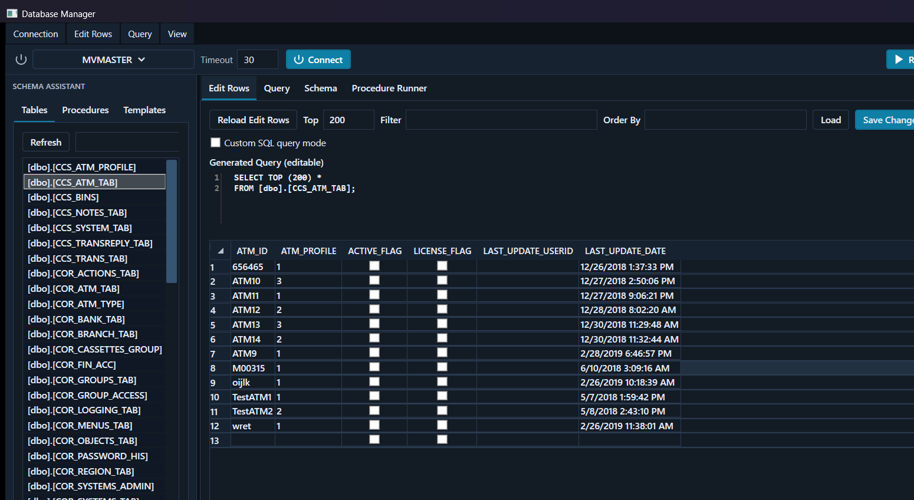
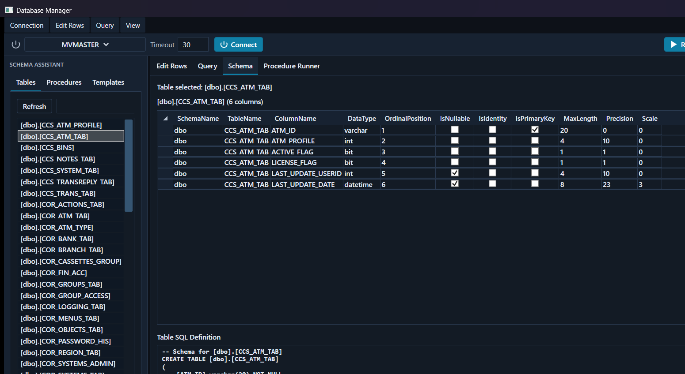

# DatabaseManager

A desktop SQL utility for SQL Server built with WPF on .NET 8.

DatabaseManager combines query authoring, schema exploration, template management, result export, stored procedure execution, and transactional row editing in a single Windows app.

## Highlights

- SQL editor tab with multiline query authoring, context-aware autocomplete (keywords, tables, columns, FK-based join hints, recent fragments), and multi-batch script execution (`GO`-separated batches run sequentially, so a copied "Script as CREATE" with `USE`/`SET .../GO` boilerplate just works).
- Schema Assistant panel for tables, procedures, and query templates, with script-generation context menus (SELECT/INSERT/UPDATE/DELETE/EXEC, Drop/Drop+Recreate Table, Drop Procedure/Generate ALTER Script).
- Saved connection profiles (DPAPI-encrypted at rest) alongside a raw connection-string fallback, with a designatable default that auto-connects on startup.
- Command palette (Ctrl+Shift+P), searchable shortcuts help panel (Ctrl+/), and a top menu — all driven from one command registry, so they never drift out of sync.
- Result viewing and export to CSV and Excel, with expandable per-statement sections for multi-statement/multi-batch results, and cell/row marking.
- Stored procedure runner with parameter input.
- Edit Rows mode:
  - Load `TOP (N)` rows from a selected table.
  - Optional `WHERE` predicate and `ORDER BY` expression.
  - Two-way sync between filter inputs and generated editable SQL, with comments in custom SQL preserved across mode toggles.
  - PK-based update and delete operations in SQL transactions; deleting without a primary key uses a user-selected-column predicate with an intended-vs-matched row-count safeguard.
- Dark and light themes, toast notifications for background failures, hand-authored vector icons throughout.
- Schema Assistant panel toggle and keyboard shortcuts.

## Screenshots

Save the screenshots under `docs/images/` using the filenames below, then they will render here automatically.

### Edit Rows Tab



### Schema Tab



## Tech Stack

- UI: WPF (`net8.0-windows`)
- Core logic/services: .NET (`net8.0`)
- SQL provider: `Microsoft.Data.SqlClient`
- Exports:
  - CSV: `CsvHelper`
  - Excel: `ClosedXML`
- Tests: xUnit

## Solution Layout

```text
DatabaseManager.slnx
src/
  DatabaseManager.Core/
  DatabaseManager.Wpf/
tests/
  DatabaseManager.Tests/
```

See detailed architecture in [docs/ARCHITECTURE.md](docs/ARCHITECTURE.md).

## Prerequisites

- Windows 10/11
- .NET 8 SDK
- Access to a SQL Server instance

Optional:
- GNU Make, if you want to use the provided `Makefile` shortcuts

## Quick Start

### Using dotnet CLI

```powershell
dotnet restore DatabaseManager.slnx
dotnet build DatabaseManager.slnx -c Debug
dotnet run --project src/DatabaseManager.Wpf/DatabaseManager.Wpf.csproj -c Debug
```

### Run tests

```powershell
dotnet test DatabaseManager.slnx -c Debug
```

### Using Makefile (optional)

```powershell
make build CONFIG=Debug
make run CONFIG=Debug
make test CONFIG=Debug
```

## How To Use

### 1. Connect and load metadata

1. Click the connection summary button in the toolbar to open the connection picker.
2. Either pick a saved profile or enter a raw connection string on the picker's fallback tab; optionally mark a profile as the default so it auto-connects on startup.
3. Set the timeout (seconds) in the toolbar.
4. Connecting loads schema metadata automatically.

### 2. Browse schema

Use the left **Schema Assistant** tabs:

- **Tables**: search and inspect table columns/definition.
- **Stored Procedures**: search and inspect parameters/definition.
- **Query Templates**: save, load, refresh, and delete templates.

### 3. Author and run SQL

1. Open the **SQL Editor** tab.
2. Enter SQL or use generation actions from object context menus.
3. Click **Run**.
4. Review output in **Results**.

### 4. Edit table rows

1. Select a table from Schema Assistant.
2. Open **Edit Rows** tab.
3. Configure:
   - `Top`
   - `Filter` (optional SQL predicate body)
   - `Order By` (optional SQL order expression)
4. Click **Load**.
5. Modify rows directly in grid.
6. Click **Save Changes** to commit updates.
7. Right-click row and choose **Delete Row...** to remove a row.

Notes:

- Save and delete require a primary key.
- Save and delete actions are transactional.

### 5. Execute stored procedures

1. Select procedure in Schema Assistant.
2. Open **Procedure Runner**.
3. Provide parameter values.
4. Click **Execute Procedure**.

### 6. Export results

In **Results** tab:

- **Export CSV**
- **Export Excel**

## Keyboard Shortcuts

- `Ctrl+1`..`Ctrl+5`: Switch output tabs (Edit Rows/SQL Editor/Schema/Results/Procedure Runner)
- `Ctrl+E`: Run query, or refresh Edit Rows if that tab is active
- `Ctrl+Q`: Cancel running query
- `Ctrl+R`: Refresh Edit Rows
- `Ctrl+S`: Save Edit Rows changes
- `Ctrl+Space`: Trigger SQL suggestions (Up/Down/Enter/Tab/Escape to navigate)
- `Ctrl+Shift+P`: Open the command palette
- `Ctrl+/`: Open the shortcuts help panel

The palette and help panel always reflect the full, current set — check there if this list drifts.

## Data and Storage

- Query templates are stored in:
  - `%LocalAppData%/DatabaseManager/query-templates.json`
- Saved connection profiles (connection strings DPAPI-encrypted) are stored in:
  - `%LocalAppData%/DatabaseManager/connection-profiles.json`

## Security and Safety Notes

- Protect credentials in connection strings.
- `Filter` and `Order By` in Edit Rows are interpreted as SQL fragments for row loading; use trusted input.
- Row value writes are parameterized.
- SQL object names are escaped in row-edit operations.

## Known Limitations

- Focused on SQL Server (`Microsoft.Data.SqlClient`).
- Edit Rows update/delete without a primary key relies on a user-selected-column predicate with a row-count safeguard, since there's no other reliable way to identify a specific row.
- One SQL Editor/Results pair at a time — no multi-tab query documents yet.

## Documentation

- Documentation Index: [docs/README.md](docs/README.md)
- Architecture: [docs/ARCHITECTURE.md](docs/ARCHITECTURE.md)
- User Guide: [docs/USER_GUIDE.md](docs/USER_GUIDE.md)
- Troubleshooting: [docs/TROUBLESHOOTING.md](docs/TROUBLESHOOTING.md)

## Testing Coverage

168 tests across pure/deterministic logic in both projects: SQL parsing/batch-splitting, row-edit SQL construction and the no-PK delete safeguard, procedure parameter mapping, query-assistant SQL generation, template/connection-profile/export storage, the command registry, and every extracted ViewModel (tested against fakes, no database required). No database-integration tests exist — see [docs/ARCHITECTURE.md](docs/ARCHITECTURE.md#testing-strategy).

See: [tests/DatabaseManager.Tests](tests/DatabaseManager.Tests)

## Contributing

1. Create a branch.
2. Build and run tests.
3. Keep UI and service behavior aligned with existing architecture.
4. Submit a PR with clear change notes and validation steps.
